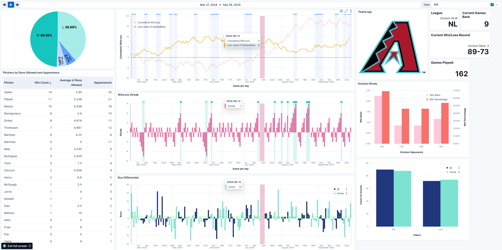

# MLB Game Records

## What you need
- Python (probably v3, untested with 2)
- pip
  - pybaseball
  - pandas
  - elasticsearch
- Elasticsearch cluster (with kibana)
  - [On-Premise in docker](https://www.elastic.co/docs/solutions/search/run-elasticsearch-locally): `curl -fsSL https://elastic.co/start-local | sh`

## Data

Information is pulled via the pybaseball library, using the schedule_and_record CLI.

## So, how do I do this?
- Once you've spun up your elasticsearch cluster, replace the values in `connect.ini` with the information from your `.env` file
- Upload `mlb_games_dashboard.ndjson` to kibana (http://localhost:5601) by going to `Hamburger >> Stack Management >> Saved Objects >> Import`
- Execute the script with `python3 ./pybaseball_to_es.py`
  - If everything works correctly, the component_template, index_template, and index should all be created before data gets pulled from pybaseball

# NOTE: 

By default, external links are disabled by default (which is what the tema logos use)
Add this setting in the `docker-compose.yml`

```
kibana:
  ...
  environment:
    - VIS_TYPE_VEGA_ENABLEEXTERNALURLS=TRUE
```
And then restart the container with `docker compose up -d`



## Additional Links
- [pybaseball](https://pypi.org/project/pybaseball/)
- [elasticsearch python](https://www.elastic.co/docs/reference/elasticsearch/clients/python)
